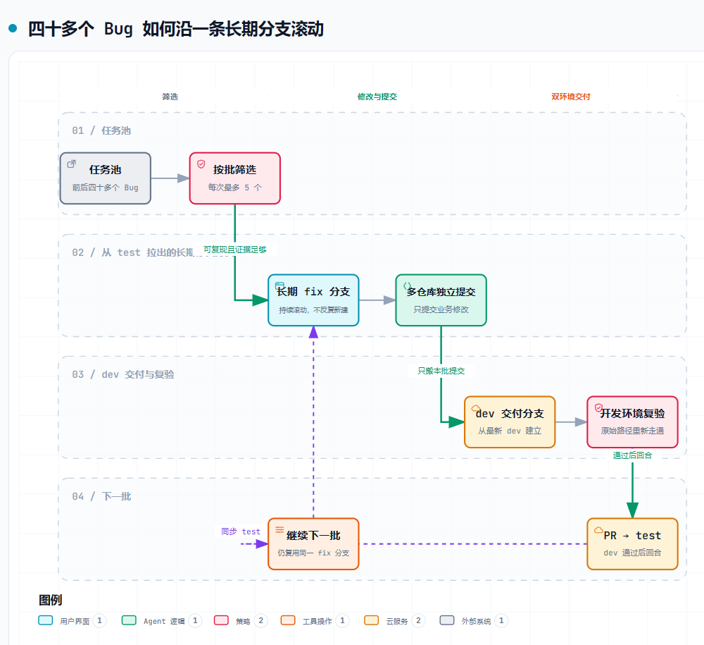
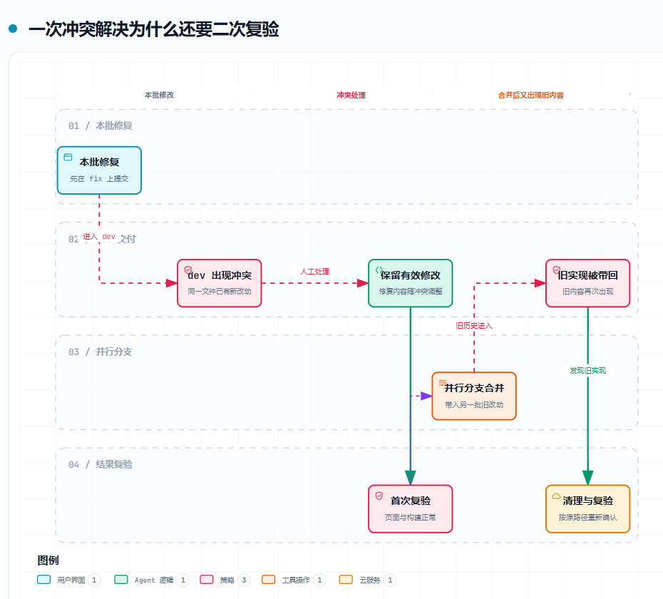

最初只是任务系统里的一批缺陷：从列表顶部往下看，每次最多处理 5 个，线上能复现的优先，证据不足的先放着，不为了凑数硬改。

列表里当时有 37 个 Bug，后来又陆续补进来一些。前前后后四十多个修复，全压在同一条长期分支上，也涉及好几个前后端仓库。每轮都要先在本地验收，再进入 `dev` 复验，最后回到 `test`。

刚开始，注意力几乎都在页面、接口和日志上。做过几轮才发现，真正容易失控的不是某个 Bug，而是==一条持续生长的修复分支，怎么把每一小批修改准确送进各走各的 `dev` 和 `test`==。

这篇记录不准备展开讲 Git 命令。只搬指定提交的 cherry-pick、把两条分支接到一起的 merge，以及把自己的提交挪到最新分支后面的 rebase，定义随处都能查到。真实项目里更难的是另一件事：这次只准备带几个修复，还是准备把整条分支合过去？如果连这个问题都没想清楚，命令越熟练，越容易把范围搞大。

## 一条分支塞进四十多个 Bug

为了避免每 5 个 Bug 都新建一组分支和 PR，我们从 `test` 拉出 `fix_overseas_bugs`，之后几个批次一直复用。每个 Bug 单独提交；涉及多个仓库时，各仓库也保留自己的提交边界。

这个决定解决了一个很现实的问题：任务很多，但每批的交付仍然可以沿着提交记录找回来。与此同时，它也埋下了后面的麻烦。分支活得越久，带着的旧批次、同步记录和冲突结果越多；几个仓库里虽然都有同名 `fix` 分支，实际进度却各算各的，不能看见名字一样就当成同一份状态。

一批任务很少刚好落在一个仓库里。任务系统中只有一个编号，代码侧却可能要在几个仓库分别提交和验收；也有些问题只改一个文件就结束。交付时只能按实际改动落单，不能因为同批其他问题碰过某个仓库，就把它顺手塞进 PR。

本地工作区又不是“随时可以清空”的实验台。有些环境相关修改必须留着才能把服务跑起来，却明确不能进入远端。每次暂存前都要按文件核对，而不是一句 `git add .` 收工。修复本身只有两个文件，工作区却显示十几个变化时，剩下那些本地环境文件就应该继续留在工作区，而不是跟着提交。

| 当时的约束 | 落到操作上是什么样 |
|---|---|
| 每批最多 5 个 | 只扫描这一批；解决不了就记录原因，不向下硬凑 |
| 线上复现优先 | 先确认用户路径，再判断本地是否具备同样环境 |
| 一个 Bug 一个边界 | 提交格式统一为 `fix: 中文内容`，便于按批次投递 |
| 多仓库协作 | 每个仓库分别核对分支、提交和文件 |
| 环境修改不得提交 | 本地要保留才能运行，但不能混进任何 PR |

这里还有一个容易写错的背景。我们的通用方案里，紧急修复通常从稳定分支拉出来，进入开发环境验证后再合回去；这个项目当时走的却是 `test → fix → dev 验证 → test`。这是当前项目自己的走法，换一个仓库，还是得先问清楚从哪条分支开始、最后准备合到哪里。

图里看起来像一条顺滑的流水线，真正执行时却有两套状态要同时盯着：任务有没有修好，以及这次修改有没有准确进入目标分支。前者靠复现和验收判断，后者靠提交、文件清单和 PR 判断，少看一层都可能留下坑。

长期分支也不是每天机械地向前滚。某个 Bug 在线上可以稳定出现，本地却缺少对应账号或数据时，会先保留编号和复现证据；有些问题已经被其他提交顺手覆盖，则核对目标分支结果后直接跳过。每批“最多 5 个”限制的是注意力和交付范围，不是要求仓库里一定新增 5 条提交记录。

## 双线交付，比修完 Bug 更麻烦

原始 `fix` 从 `test` 拉出，而开发环境跑在 `dev`。两边都在继续接收别人的修改，时间一长，代码和提交记录自然会越走越远。最初稳定下来的交付方式很克制：在长期 `fix` 上开发；需要开发环境复验时，从最新 `dev` 建立临时交付分支，只挑出本批提交；通过 PR 进入 `dev`；验证完成后，再由原始 `fix` 向 `test` 提 PR。

这样做的价值不在于提交记录漂亮，而在于范围清楚。如果本批实际只动了两个文件，dev PR 里就应该只有这两个文件，不该顺带带上前一批修改，更不该带上为了本地启动而调整的配置。

真实提交很快出现了“两套身份”︰

| 修复记录 | fix 上的原提交 | dev 上的交付提交 |
|---|---|---|
| 修复 A | `1446162` | `e2bad58` |
| 修复 B | `d02789a` | `9be98e5` |
| 修复 C | `959ed1c` | `92560c0` |

这些短 SHA，也就是 Git 给每次提交生成的编号，只用于还原当时的排查过程。同一份修改被 cherry-pick 到 `dev` 后，会得到一个新的提交号。于是会出现一种很别扭的状态：功能明明已经在 `dev`，直接搜索原来的提交号却找不到。

前几批里，大部分提交还能通过修改内容互相对上。冲突一旦需要人工处理，两边最后留下的代码也会有差别，这种自动对照就不再可靠。此后维护了一张很朴素的交付表，记录“任务、仓库、原提交、dev 交付提交、PR、验收结果”。它不优雅，却比仅凭 `git log` 回忆可靠得多。

这张表还有一个用处：能把“代码完成”和“环境验证完成”拆开。`dev` 刚合入时状态记为“待复验”，只有原始复现路径通过才允许进入 `test`。如果开发环境暴露出新问题，修复仍然落回长期 `fix`，再产生一笔新的 dev 交付记录。这样做看起来多记了一行，实际上避免了在两个临时分支上各改一份，最后连哪份才是源头都说不清。

:::note[提交存在，不等于功能正确]
提交号、文件差异和 PR 记录都只是线索。出现冲突处理时，仍要回到目标文件和原始验收路径。
:::

## 一次冲突解决，为什么还要二次复验

其中一次修复碰到了很典型的冲突：`fix` 和 `dev` 同时改过一个入口文件。挑选提交时 Git 停了下来，这种情况不能简单选择“保留这一边”或“保留另一边”，而要先弄清两边分别解决了什么，再把仍然有效的部分留下来。

第一次处理完成后，构建和页面验收都通过了。按常规理解，这个 Bug 已经结束。可后面另一个并行分支合入时，一段旧实现又被带回同一文件，随后才由新的清理提交删除。

这件事改变了后续验收方式。冲突解决之后，不再只确认“页面还能打开”，而是沿原来的复现步骤再走一遍，并检查相关文件里有没有重复实现。第一次 PR 里的正确结果，不能替后续并行合并后的最终代码作担保。

一次清理提交还留下了另一个小插曲。它的标题以 `merge:` 开头，Git 记录里却只是普通提交，并没有真的把两条分支合在一起。后来再查历史，提交标题只当作线索，最终还是看 Git 实际记录了什么。++标题是人写的，分支怎么走是 Git 记下来的++。

| 表面上已经完成 | 后来补做的核对 | 防的是什么 |
|---|---|---|
| 冲突标记已清零 | 对比冲突前后两侧的业务逻辑 | 误删目标分支的新实现 |
| 构建通过 | 重新走原始复现路径 | 文本能编译，行为却已经倒退 |
| PR 已合并 | 搜索旧入口、重复函数和配置分支 | 并行合并把旧代码重新带回 |

这不是对每个文件做一遍地毯式测试。复验只围绕冲突文件和原 Bug 展开：哪里发生冲突，就重新走一遍那部分原本失败的操作，再检查有没有旧实现被带回来。相比“随便点几下看看”，这种复验至少知道自己在防什么。

## 差点把整条 test 历史送进 dev

批次越来越多之后，cherry-pick 的副作用也开始明显：同一份修改在 `dev` 和 `test` 有不同提交号，人工处理过冲突后，两边甚至很难自动对上。那时出现过一个很自然的想法：既然反复搬提交这么麻烦，不如直接把完整 `fix` merge 进 `dev`，让 Git 明确知道两条分支已经合过。

这个方案没有马上执行。先在干净环境里做了一次只读预演，结果让人立刻冷静下来：当时几个仓库的 `dev` 和 `fix` 都已经积累了不少各自独有的提交，直接对比会出现几十甚至上百个文件；合并预演里还出现了多处真实冲突。

最先看到的不是冲突标记，而是一大串和本批无关的删除、配置变更与旧文件。那一刻，讨论重点从“冲突怎么解”变成“为什么它们会出现在这里”。答案并不神秘：长期 `fix` 从 `test` 拉出，自然带着 `test` 后来积累的改动；`dev` 也一直在接收别人的代码，两边早就各走各的。把 `dev` 合回原始 `fix` 虽然方便在本地看冲突，却会让后续 `fix → test` 的 PR 混入只属于 `dev` 的提交，同样不适合作为正式方案。

这已经不是“把本批两个 Bug 送进 dev”，而是在处理 `test` 和 `dev` 长时间各自积累下来的差异。更危险的是，有些无关改动并不会产生冲突，Git 会安静地把它们合进去。红色冲突至少会把操作拦住，混进来的无关文件却可能一路通过构建和审核。

当时的合并前检查只有三步：

1. 看两边各自多了多少提交，判断已经分开多久；
2. 看目标 PR 会触及哪些文件，是否仍然符合本批任务；
3. 先算一遍合并结果，看看会冲突在哪里，但不动当前工作区。

:::warning[先看范围，再谈怎么解冲突]
`git diff dev..fix` 展示的是两条分支现在相差什么，不能直接当成 PR 最后会修改多少文件。它适合提醒风险，不适合单独下结论。真正的停止信号是：本批只修两三个问题，预演却开始讨论几十个无关文件。
:::

整体 merge 最终没有落地。这里并不是 cherry-pick 胜过 merge，只是这轮要带过去的是几份明确修复，不是把两条长期分支正式接到一起。为了让提交记录看起来整齐，反而把一堆无关文件送进 PR，这笔账不划算。

## 最后稳定下来的做法

滚动到后半段，流程逐渐变成一组可以重复执行的检查，而不是一句“以后都用某个命令”。

每次准备 PR 时都会留下一张很短的交付卡：源分支与目标分支、这一批的任务编号、各仓库提交、允许出现的文件、构建命令、原始复现步骤。审核时先看这张卡，再看实际文件差异。它把“应该有什么”写在 Git 结果之前，文件一旦越界就能立刻停下，不需要等到合并后再猜哪个变化是顺带进来的。

每批开始前先跟上最新 `test`，长期 `fix` 继续承接明确的 Bug 修复；一次最多看 5 个，无法复现、证据不足或已有等价修改就停在本批，不往后凑。每个仓库单独确认当前分支和工作区，环境配置只保留在本地，暂存前按文件核对。

准备进入 `dev` 时，从最新 `dev` 创建干净交付分支，只带本批已经在本地验收过的提交。遇到冲突不能整块覆盖，要看两边实际改了什么；构建通过后重走原始复现路径，再检查相对 `dev` 的文件清单。这个分支只负责开发环境复验，不反向合进从 `test` 拉出的长期 `fix`。

`dev` 验证通过后，再从原始 `fix` 向 `test` 提 PR。PR 合并并不意味着本地分支会自己更新，下一批开始前还得把远端最新 `test` 拉下来。后续怎么跟上去，要看这条 `fix` 有没有被别人使用、是否还有没合入的提交，以及工作区里有没有必须保留的环境修改。

| 当前状态 | 处理方式 | 为什么 |
|---|---|---|
| `fix` 的提交已经全部进入 `test` | 直接跟到最新 `test` | 只把分支位置往前推，不改旧提交 |
| `fix` 还有自己的提交，而且多人复用 | merge 最新 `test` | 不改别人已经拿到的提交记录 |
| 只有自己在用，也没有打开的 PR | 可以用 rebase | 把自己的提交接到最新 `test` 后面 |
| 明确不要当前提交和工作区修改 | 才考虑 `reset --hard` | 这是丢弃状态，不是同步状态 |

这段时间还讨论过用 rebase 跟上远端最新 `test`。后续的约定是：只有这段提交还没共享、也没有人在它上面继续开发时，才用 rebase 把自己的提交接到最新 `test` 后面；共享出去以后，就改用 merge，免得同事手里的提交号突然全部变化。

Git 里并不存在 `rebase --hard`。这个说法通常混合了两个完全不同的动作：rebase 是把自己的提交重新接到最新分支后面，`reset --hard` 则会把分支和已跟踪的本地文件一起拉回指定位置。项目里恰好有一些“必须保留才能启动、又不能提交”的环境修改，因此后者尤其不能当作日常同步命令。

如果一定要把几个动作压缩成一句话：cherry-pick 适合搬选定修复，merge 适合让两条分支正式合到一起，rebase 适合让尚未共享的个人提交跟上远端最新状态。说明到这里就够了；这次真正留下来的不是命令口诀，而是下面三条检查顺序：

1. **先确认这次要带什么。** 是两个 Bug，还是整条分支？
2. **再确认分支怎么走。** 从哪里拉出来，最后准备合到哪里？
3. **最后才选操作。** PR 文件范围、冲突结果和用户路径都能解释清楚，命令才算选对。

回头看，长期 `fix` 并不是一个错误决定。它让四十多个 Bug 能按小批次持续推进，也让每次修复都有固定的承接位置。真正需要补上的，是长期使用之后必不可少的交付记录、提交前文件核对和二次复验。

以前容易把“没有冲突”当成安全，把“PR 已合并”当成结束。现在更愿意在按下 Enter 前多看一眼：++这次准备带走的，究竟是几处修复，还是一整段没有打算交付的历史？++
